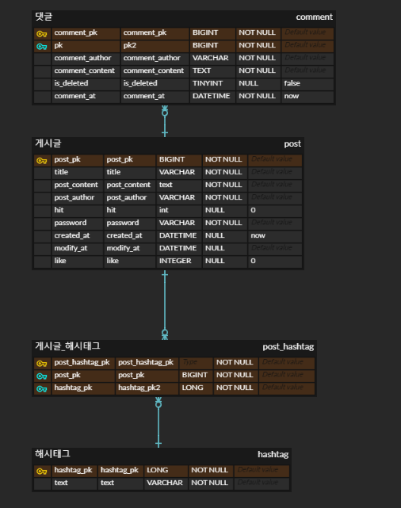
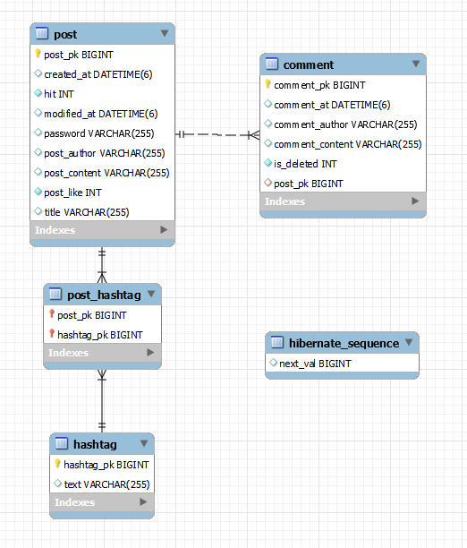

# 게시판 만들기 연습
## 기획
### 게시판 구현하기
* 요구사항 완성도
* 좋은 코드
* 좋은 설계
위 세가지 관점에서 수행하기

## 설계
### 요구사항
1. 사용자는 게시글과 댓글을 읽을 수 있다.
2. 사용자는 게시글과 댓글을 작성할 수 있고, 텍스트만 가능하다.
3. 본인이 작성한 게시글은 수정 또는 삭제할 수 있다.
4. 본인 확인을 위한 비밀번호는 암호화하여 DB에 저장한다.
5. 게시글에는 해시태그 최대 5개를 등록할 수 있다.

6. 게시글 목록 화면에는 게시글 전체건수와 댓글 전체건수를 표시한다.
7. 게시글 목록에는 제목, 작성자, 작성일시, 댓글 수, 조회수, 좋아요수를 표시한다.
8. 게시글 목록에서 제목, 작성자, 해시태그, 내용을 선택하여 문자열을 검색할 수 있다.
9. 게시글 목록은 최신순으로 10개 또는 20개씩 페이징 처리한다.
10. 댓글은 게시글 본문 하단에 최신 5건을 노출하고, 5건씩 `더 보기`로 과거 댓글을 조회할 수 있다.

11. 게시글 목록에서 최근 3일 이내 등록된 글은 [New] 텍스트를 붙여 식별할 수 있다.
12. 게시글 목록에서 제목을 클릭하면 게시글 상세로 이동하고, 조회수를 갱신하고 건수를 확인할 수 있다.
13. 게시글 상세에서 `Like` 또는 `unlike`를 할 수 있고, Like 건수를 표시한다.
14. 삭제 처리된 댓글은 `삭제된 댓글입니다.`라고 내용 대신 메시지를 노출한다.

### ERD 설계

### 기술스택
* 형상관리, 이슈관리
  * Git, Github
* Backend
  * IDE : IntelliJ
  * Java 8
  * JDK 1.8
  * 프레임워크 : SpringBoot 2.7.14
  * 빌드 도구 : Kotlin Gradle
  * ORM : JPA Hibernate
  * DB : MySQL 8.0.33
* Frontend
  * HTML5 & CSS3, Javascript
  * Vue3
  * IDE : VScode
  * Bootstrap5

## Backend
### Backend API Docs
[swagger api docs](https://pangpyo.github.io/)

### ERD 결과

### 개발 완료된 요구사항
1. 사용자는 게시글과 댓글을 읽을 수 있다.
2. 사용자는 게시글과 댓글을 작성할 수 있고, 텍스트만 가능하다.
3. 본인이 작성한 게시글은 수정 또는 삭제할 수 있다.
  * 게시글 수정, 혹은 삭제 전 패스워드를 입력한 후 삭제를 할 수 있도록 한다.
4. 본인 확인을 위한 비밀번호는 암호화하여 DB에 저장한다.
  * SHA-256 알고리즘 사용
5. 게시글에는 해시태그 최대 5개를 등록할 수 있다.
  * 5개 초과시 등록되지 않음
  * 게시글과 해시태그는 N:M관계
6. 게시글 목록 화면에는 게시글 전체건수와 댓글 전체건수를 표시한다.
7. 게시글 목록에는 제목, 작성자, 작성일시, 댓글 수, 조회수, 좋아요수를 표시한다.
8. 게시글 목록에서 제목, 작성자, 해시태그, 내용을 선택하여 문자열을 검색할 수 있다.
  * 제목, 작성자, 내용은 문자열이 포함된 내용을 모두 검색하고, 해시태그는 해당 해시태그와 일치하는 해시태그를 가진 게시글 모두 검색
9. 게시글 목록은 최신순으로 10개 또는 20개씩 페이징 처리한다.
  * 게시글은 pk 역순으로 10개씩 페이징 처리함
10. 댓글은 게시글 본문 하단에 최신 5건을 노출하고, 5건씩 `더 보기`로 과거 댓글을 조회할 수 있다.
  * pk역순으로 5개씩 페이징처리함
11. 게시글 목록에서 최근 3일 이내 등록된 글은 [New] 텍스트를 붙여 식별할 수 있다.
  * 3일이내 등록된 글에 대하여 new 를 true로 송신함
12. 게시글 목록에서 제목을 클릭하면 게시글 상세로 이동하고, 조회수를 갱신하고 건수를 확인할 수 있다.
  * 게시글 detail 조회시 조회수 +1
13. 게시글 상세에서 `Like` 또는 `unlike`를 할 수 있고, Like 건수를 표시한다.
  * 중복으로 Like 또는 unlike 할 수 있으며, like시 좋아요 증가, unlike시 좋아요 감소
14. 삭제 처리된 댓글은 `삭제된 댓글입니다.`라고 내용 대신 메시지를 노출한다.
  * 삭제처리된 댓글은 댓글 내용 대신 "삭제된 댓글입니다" 송신

## Frontend
### 개발 완료된 요구사항
1. 사용자는 게시글과 댓글을 읽을 수 있다.
7. 게시글 목록에는 제목, 작성자, 작성일시, 댓글 수, 조회수, 좋아요수를 표시한다.
9. 게시글 목록은 최신순으로 10개 또는 20개씩 페이징 처리한다.
  * 게시글은 최신순으로 10개씩 조회가능, 숫자 입력을 통해 페이지 이동 가능
11. 게시글 목록에서 최근 3일 이내 등록된 글은 [New] 텍스트를 붙여 식별할 수 있다.
  * new 가 true인 게시글에 대해 [New] 텍스트를 붙여 식별
12. 게시글 목록에서 제목을 클릭하면 게시글 상세로 이동하고, 조회수를 갱신하고 건수를 확인할 수 있다.
  * 게시글 detail 조회시 조회수 +1
14. 삭제 처리된 댓글은 `삭제된 댓글입니다.`라고 내용 대신 메시지를 노출한다.
  * 삭제처리된 댓글은 댓글 내용 대신 "삭제된 댓글입니다" 표시

## 프로젝트 사용법
* 사용된 프로그램들을 버전에 맞게 설치합니다.
* database는 username : ssafy, password : ssafy입니다.
  * 별도의 jpa를 사용했으므로 ddl파일 없이, 스프링부트 프로젝트를 실행하면 db 스키마와 테이블이 생성됩니다.
* board폴더에 있는 SpringBoot 프로젝트 실행 후 http://localhost:8080/swagger-ui.html를 통해 swagger api문서를 확인 할 수 있고, http요청을 시도할 수 있습니다.
* SpringBoot 프로젝스 실행 후 board-front에 있는 Vue 프로젝트를 실행하면 클라이언트 화면을 확인 할 수 있습니다.
